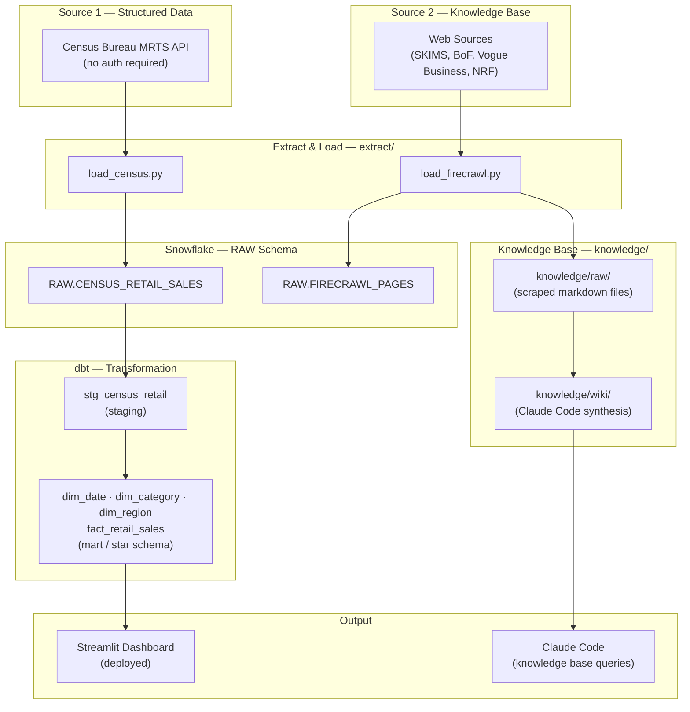
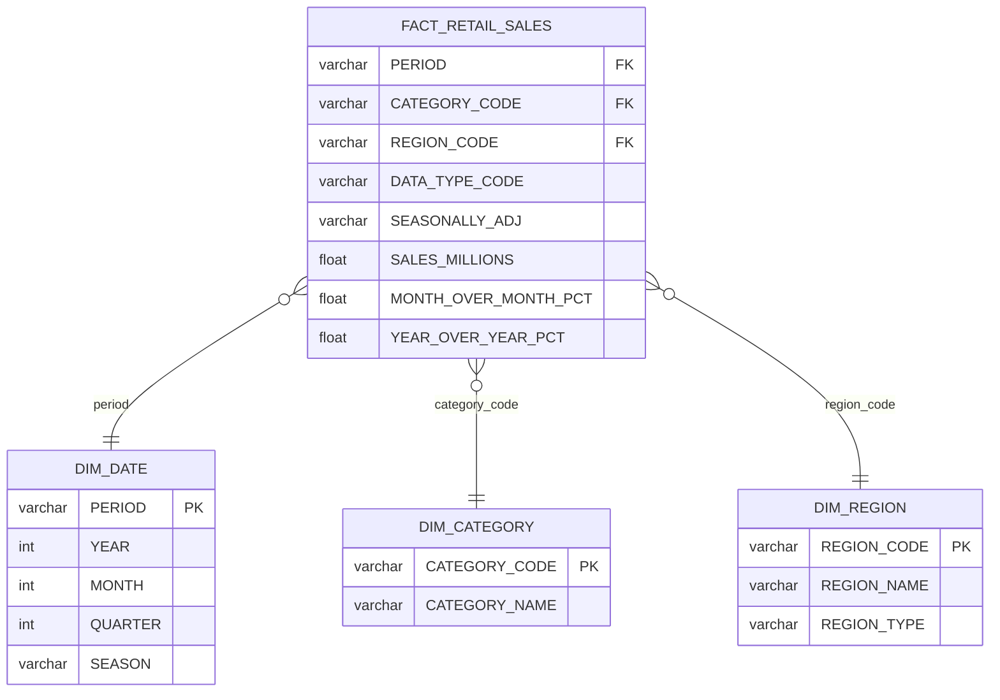

# Retail Planning Analytics — SKIMS Market

End-to-end analytics pipeline targeting the **Planning Analyst** role at SKIMS. Pulls US retail sales data from the Census Bureau API, scrapes industry sources via Firecrawl, loads both into Snowflake, transforms through a dbt star schema, and surfaces seasonal demand insights in a Streamlit dashboard.

**Core business question:** How does seasonal demand in the shapewear, loungewear, and intimates category behave — and what does that mean for inventory positioning?

---

## Tech Stack

| Layer | Tool |
|---|---|
| Data Warehouse | Snowflake |
| Transformation | dbt |
| Orchestration | GitHub Actions |
| Dashboard | Streamlit |
| Web Scraping | Firecrawl |
| Language | Python, SQL |

---

## Data Sources

| # | Source | Type | Target |
|---|---|---|---|
| 1 | US Census Bureau Monthly Retail Trade Survey (MRTS) | REST API | `RAW.CENSUS_RETAIL_SALES` |
| 2 | SKIMS, Business of Fashion, Vogue Business, NRF | Web scrape (Firecrawl) | `RAW.FIRECRAWL_PAGES` + `knowledge/raw/` |

---

## Repo Structure

```
planning-analyst-retail/
├── extract/
│   ├── load_census.py        # Census MRTS API → Snowflake RAW
│   ├── load_firecrawl.py     # Firecrawl scrape → Snowflake RAW + knowledge/raw/
│   ├── requirements.txt
│   └── .env.example
├── dbt/                      # dbt project (staging + mart models)
├── dashboard/                # Streamlit app
├── knowledge/
│   ├── raw/                  # Scraped source files (markdown)
│   └── wiki/                 # Claude Code-generated synthesis pages
└── docs/
    ├── proposal.md
    └── job-posting.pdf
```

---

## Setup

### 1. Clone and install dependencies

```bash
git clone https://github.com/lillianalexalabra/planning-analyst-retail.git
cd planning-analyst-retail
python3 -m venv .venv
source .venv/bin/activate
pip install -r extract/requirements.txt
```

### 2. Configure credentials

Copy `.env.example` to `.env` at the project root and fill in your values:

```bash
cp extract/.env.example .env
```

Required variables:

```
SNOWFLAKE_ACCOUNT=
SNOWFLAKE_USER=
SNOWFLAKE_PASSWORD=
SNOWFLAKE_DATABASE=
SNOWFLAKE_WAREHOUSE=
SNOWFLAKE_ROLE=
FIRECRAWL_API_KEY=
```

### 3. Run extraction scripts

```bash
# Load Census MRTS data into Snowflake RAW
python extract/load_census.py

# Scrape web sources into Snowflake RAW + knowledge/raw/
python extract/load_firecrawl.py
```

### 4. Run dbt transformations

```bash
set -a; source .env; set +a
dbt run --profiles-dir dbt --project-dir dbt
dbt test --profiles-dir dbt --project-dir dbt
```

This creates the `MARTS` schema in Snowflake with five models:
- `stg_census_retail` (view) — cleaned staging layer
- `dim_date`, `dim_category`, `dim_region` (tables) — dimension tables
- `fact_retail_sales` (table) — monthly sales with MoM and YoY metrics

---

## Snowflake Schema (RAW Layer)

**`RAW.CENSUS_RETAIL_SALES`** — US monthly retail sales from Census MRTS API (2019–present)

| Column | Description |
|---|---|
| `cell_value` | Sales figure |
| `time_slot_id` | Period (YYYY-MM) |
| `category_code` | NAICS-based retail category |
| `data_type_code` | Measure type (SM = sales in $M) |
| `seasonally_adj` | Whether seasonally adjusted |
| `error_data` | Margin of error |
| `geo_level` | Geography (US) |
| `_loaded_at` | Ingestion timestamp |

**`RAW.FIRECRAWL_PAGES`** — Scraped web content

| Column | Description |
|---|---|
| `url` | Source URL |
| `source_name` | Publication (skims, businessoffashion, nrf, etc.) |
| `content` | Full markdown text |
| `scraped_at` | When Firecrawl fetched it |
| `_loaded_at` | Ingestion timestamp |

---

## Pipeline Diagram



## ERD



---

## Insights Summary

Analysis of US Census Bureau Monthly Retail Trade Survey data (NAICS 448 — Clothing and Clothing Accessories Stores, 2019–2026) surfaces three planning-relevant findings:

**1. December dominates — inventory must be positioned by mid-October.**
December averages $9.3B in monthly clothing sales, 60% above the $5.8B annual monthly average and nearly 40% above November ($6.7B). With a 6–8 week apparel lead time, holiday inventory purchase orders must be placed by mid-October at the latest to land product in time.

**2. Q4 runs 24.5% above the annual average — but the window is narrow.**
October–December combined average $7.2B/month vs. $5.8B annually. August shows a secondary peak ($6.1B, back-to-school) before a September dip. Planning teams should treat August–December as continuous elevated-demand period requiring early inventory commitment.

**3. January is the sharpest single-month demand drop in the calendar.**
January averages $4.4B — 53% below December's peak. This makes January the natural markdown and clearance window. Inventory not cleared before January faces the steepest price-pressure environment of the year.

**Bonus — COVID impact and recovery (2020–2022):**
The clothing category fell 25% in 2020 ($261B → $195B annual) due to store closures and reduced occasion-wear demand. It rebounded past 2019 levels by 2022 ($293B) and continued growing through 2024 ($304B), suggesting the category's long-run demand trajectory is intact.

---

## Knowledge Base

The `knowledge/` folder is a queryable knowledge base about SKIMS's market. Run Claude Code against this repo and ask questions like:

- "What does my knowledge base say about SKIMS's competitive position?"
- "What are the key demand drivers for shapewear?"
- "What inventory challenges does the fashion industry face heading into Q4?"

See `CLAUDE.md` for query conventions.

---

## Status

| Milestone | Status |
|---|---|
| Proposal | ✅ Complete |
| Milestone 01: Extract & Load | ✅ Complete |
| Milestone 02: Transform, Dashboard & Knowledge Base | ✅ Complete |
| Final Submission | 🔲 Pending |
