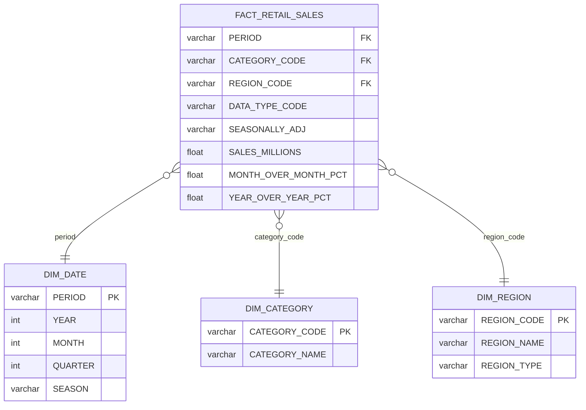

# Milestone 02 Implementation Plan

> **For agentic workers:** REQUIRED SUB-SKILL: Use superpowers:subagent-driven-development (recommended) or superpowers:executing-plans to implement this plan task-by-task. Steps use checkbox (`- [ ]`) syntax for tracking.

**Goal:** Complete all Milestone 02 deliverables: Streamlit dashboard, knowledge base expansion, ERD, pipeline update, and repo cleanup.

**Architecture:** Single `dashboard/app.py` with sidebar filters + three tabs (Overview, Seasonal Patterns, Inventory Implications) querying Snowflake MARTS schema. Knowledge base expanded to 17+ raw sources and 3 wiki pages synthesized with Claude. All changes committed with meaningful messages.

**Tech Stack:** Streamlit, snowflake-connector-python, pandas, plotly, Firecrawl, dbt (already complete), GitHub Actions

---

## File Map

| Action | Path |
|---|---|
| Modify | `.gitignore` |
| Modify | `extract/load_firecrawl.py` |
| Create | `dashboard/app.py` |
| Create | `dashboard/requirements.txt` |
| Create | `knowledge/wiki/overview.md` |
| Create | `knowledge/wiki/market-landscape.md` |
| Create | `knowledge/wiki/demand-drivers.md` |
| Create | `knowledge/index.md` |
| Modify | `README.md` (ERD section) |
| Modify | `.github/workflows/pipeline.yml` |

---

## Task 1: Repo Cleanup

**Files:**
- Modify: `.gitignore`

- [ ] **Step 1: Add dbt-specific ignore entries to `.gitignore`**

Open `.gitignore` and append after the `# macOS` section:

```
# dbt
dbt/.user.yml
dbt/logs/
```

- [ ] **Step 2: Commit**

```bash
git add .gitignore
git commit -m "chore: gitignore dbt user config and logs"
```

---

## Task 2: Add New Scraping Targets

**Files:**
- Modify: `extract/load_firecrawl.py` (lines 12–20, the `TARGETS` list)

- [ ] **Step 1: Replace the `TARGETS` list in `extract/load_firecrawl.py`**

Replace the existing `TARGETS = [...]` block (lines 12–20) with:

```python
TARGETS = [
    # existing sources
    {"url": "https://skims.com/pages/our-story",               "source_name": "skims"},
    {"url": "https://skims.com/collections/shapewear",          "source_name": "skims"},
    {"url": "https://skims.com/collections/bras-and-underwear", "source_name": "skims"},
    {"url": "https://www.businessoffashion.com/tags/skims",     "source_name": "businessoffashion"},
    {"url": "https://www.voguebusiness.com/t/skims",            "source_name": "voguebusiness"},
    {"url": "https://nrf.com/research/annual-retail-and-food-services-sales", "source_name": "nrf"},
    {"url": "https://nrf.com/research/monthly-retail-trade",    "source_name": "nrf"},
    # new sources
    {"url": "https://en.wikipedia.org/wiki/Skims",              "source_name": "wikipedia"},
    {"url": "https://en.wikipedia.org/wiki/Spanx",              "source_name": "wikipedia"},
    {"url": "https://en.wikipedia.org/wiki/Kim_Kardashian",     "source_name": "wikipedia"},
    {"url": "https://en.wikipedia.org/wiki/Shapewear",          "source_name": "wikipedia"},
    {"url": "https://skims.com/collections/loungewear",         "source_name": "skims"},
    {"url": "https://skims.com/collections/swim",               "source_name": "skims"},
    {"url": "https://skims.com/collections/home",               "source_name": "skims"},
    {"url": "https://nrf.com/topics/holiday-and-seasonal-trends", "source_name": "nrf"},
    {"url": "https://www.retaildive.com/tag/apparel/",          "source_name": "retaildive"},
    {"url": "https://www.glossy.co/tag/skims/",                 "source_name": "glossy"},
]
```

- [ ] **Step 2: Commit**

```bash
git add extract/load_firecrawl.py
git commit -m "feat: add 10 new knowledge base scraping targets"
```

---

## Task 3: Run the Scraper

**Files:**
- Creates: new `.md` files in `knowledge/raw/`

- [ ] **Step 1: Load environment and run the scraper**

```bash
set -a; source .env; set +a
python extract/load_firecrawl.py
```

Expected output ends with something like:
```
Done — 15/17 pages loaded to RAW.FIRECRAWL_PAGES and knowledge/raw/
```

Some sources (BoF, Vogue Business) may be paywalled and print `SKIP`. That is fine — the script continues on error. Aim for at least 15 total files in `knowledge/raw/`.

- [ ] **Step 2: Verify raw file count**

```bash
ls knowledge/raw/*.md | wc -l
```

Expected: 15 or more. If under 15, re-check which URLs failed and whether the Firecrawl API key is set.

- [ ] **Step 3: Commit new raw files**

```bash
git add knowledge/raw/
git commit -m "feat: scrape 10+ additional knowledge base sources"
```

---

## Task 4: Generate Wiki Pages

**Files:**
- Create: `knowledge/wiki/overview.md`
- Create: `knowledge/wiki/market-landscape.md`
- Create: `knowledge/wiki/demand-drivers.md`

For each wiki page below: read ALL files currently in `knowledge/raw/`, identify which ones are relevant to the topic, and synthesize content across multiple sources. Do not summarize a single source — each page must draw from at least 3 raw files.

- [ ] **Step 1: Write `knowledge/wiki/overview.md`**

Read all `knowledge/raw/` files. Synthesize a company overview page with this structure:

```markdown
---
title: SKIMS — Company Overview
sources: [list the raw filenames you drew from]
updated: 2026-05-02
---

# SKIMS — Company Overview

## Founding and Background
[2–3 paragraphs: Kim Kardashian's founding of SKIMS in 2019, the origin story,
initial product focus on shapewear and solutions wear, early marketing strategy
including the inclusive sizing approach. Draw from skims_com_pages_our_story.md
and wikipedia/Skims sources.]

## Product Lines
[1–2 paragraphs: current product categories — shapewear, bras & underwear,
loungewear, swim, home. Key collections and positioning within each.
Draw from the various skims.com collection pages.]

## Brand Positioning and Valuation
[1–2 paragraphs: SKIMS as a celebrity-founded DTC brand, valuation milestones
(reported ~$4B as of 2023), expansion into menswear and Team USA partnership.
Draw from Wikipedia and any business press sources available.]

## Key Milestones
[Bulleted timeline of major company events: founding, fundraising rounds,
collaborations, international expansion, menswear launch.]
```

- [ ] **Step 2: Write `knowledge/wiki/market-landscape.md`**

Read all `knowledge/raw/` files. Synthesize a competitive landscape page:

```markdown
---
title: SKIMS Market Landscape
sources: [list the raw filenames you drew from]
updated: 2026-05-02
---

# SKIMS Market Landscape

## Market Definition
[1 paragraph: define the shapewear and intimates market segment — what it includes
(shaping garments, bras, underwear, loungewear crossover), key NAICS categories
(4481 Clothing Stores, 448 Clothing and Accessories). Draw from Census/NRF sources.]

## Competitive Set
[2–3 paragraphs: SKIMS's key competitors. Spanx (original market leader, similar
positioning), Savage X Fenty (Rihanna, similar celebrity DTC playbook), ThirdLove,
Skims vs. Victoria's Secret. Draw from Wikipedia Spanx and Skims pages.]

## Market Size and Growth
[1–2 paragraphs: US retail sales context from Census MRTS / NRF data.
Clothing Stores (NAICS 4481) and Clothing and Accessories (448) market size,
seasonal growth patterns, post-pandemic recovery. Draw from NRF sources.]

## Distribution and Channel Strategy
[1 paragraph: SKIMS's DTC-first model, Nordstrom partnership, international expansion.
Contrast with legacy lingerie brands' wholesale-heavy models.]
```

- [ ] **Step 3: Write `knowledge/wiki/demand-drivers.md`**

Read all `knowledge/raw/` files. Synthesize a demand drivers page:

```markdown
---
title: Seasonal Demand Drivers — Shapewear & Intimates
sources: [list the raw filenames you drew from]
updated: 2026-05-02
---

# Seasonal Demand Drivers — Shapewear & Intimates

## Seasonal Demand Patterns
[2 paragraphs: which months drive peak demand for shapewear and intimates.
Q4 (Oct–Dec) holiday gifting, Valentine's Day (Feb), back-to-school crossover.
Draw from NRF seasonal trends and any retail press sources.]

## Q4 and Holiday Dynamics
[1–2 paragraphs: holiday gifting behavior in intimates and shapewear. Black Friday /
Cyber Monday contribution. How SKIMS and comparable brands activate promotionally.
Draw from NRF holiday forecast data and business press.]

## Inventory Challenges
[1–2 paragraphs: lead time constraints in apparel (6–8 weeks for cut-and-sew),
the challenge of chasing demand in shapewear (size range complexity amplifies
SKU count), markdown risk in trough months. Draw from any retail/fashion sources.]

## Demand Signals for Planning
[1 paragraph: what a Planning Analyst watches — sell-through rates, reorder velocity,
MoM Census MRTS trend vs. prior year. Connection to the quantitative data in this
project's dashboard.]
```

- [ ] **Step 4: Commit wiki pages**

```bash
git add knowledge/wiki/
git commit -m "feat: generate 3 knowledge base wiki pages"
```

---

## Task 5: Create knowledge/index.md

**Files:**
- Create: `knowledge/index.md`

- [ ] **Step 1: Write `knowledge/index.md`**

List the actual filenames in `knowledge/raw/` (run `ls knowledge/raw/*.md` to get them) and write the index:

```markdown
# Knowledge Base Index

This knowledge base covers SKIMS's market, the shapewear and intimates category,
and US retail industry context for planning analytics.

## Wiki Pages

| Page | Summary |
|---|---|
| [overview.md](wiki/overview.md) | SKIMS company profile: founding, product lines, valuation, and key milestones |
| [market-landscape.md](wiki/market-landscape.md) | Competitive landscape, market sizing, and distribution strategy |
| [demand-drivers.md](wiki/demand-drivers.md) | Seasonal demand patterns, Q4 dynamics, and inventory planning implications |

## Raw Sources

| File | Source |
|---|---|
[one row per file in knowledge/raw/, format: | filename.md | brief description of what site/topic it covers |]
```

Replace the `[one row per file...]` line with actual rows — one per file in `knowledge/raw/`.

- [ ] **Step 2: Commit**

```bash
git add knowledge/index.md
git commit -m "feat: add knowledge base index.md"
```

---

## Task 6: Create dashboard/requirements.txt

**Files:**
- Create: `dashboard/requirements.txt`

- [ ] **Step 1: Create the file**

Write `dashboard/requirements.txt` with exactly:

```
streamlit
snowflake-connector-python
pandas
plotly
```

- [ ] **Step 2: Commit**

```bash
git add dashboard/requirements.txt
git commit -m "feat: add dashboard requirements"
```

---

## Task 7: Create dashboard/app.py

**Files:**
- Create: `dashboard/app.py`

This app connects to Snowflake schema `MARTS` (set in `dbt/profiles.yml`) using credentials from `st.secrets`. Tables are `MARTS.FACT_RETAIL_SALES`, `MARTS.DIM_DATE`, `MARTS.DIM_CATEGORY`.

- [ ] **Step 1: Write `dashboard/app.py`**

```python
import streamlit as st
import snowflake.connector
import pandas as pd
import plotly.express as px

st.set_page_config(
    page_title="SKIMS Market Analytics",
    layout="wide",
)

MONTH_NAMES = {
    1: "Jan", 2: "Feb", 3: "Mar", 4: "Apr",
    5: "May", 6: "Jun", 7: "Jul", 8: "Aug",
    9: "Sep", 10: "Oct", 11: "Nov", 12: "Dec",
}


@st.cache_resource
def get_connection():
    return snowflake.connector.connect(
        account=st.secrets["SNOWFLAKE_ACCOUNT"],
        user=st.secrets["SNOWFLAKE_USER"],
        password=st.secrets["SNOWFLAKE_PASSWORD"],
        database=st.secrets["SNOWFLAKE_DATABASE"],
        warehouse=st.secrets["SNOWFLAKE_WAREHOUSE"],
        role=st.secrets["SNOWFLAKE_ROLE"],
    )


def run_query(sql: str) -> pd.DataFrame:
    conn = get_connection()
    cur = conn.cursor()
    cur.execute(sql)
    df = cur.fetch_pandas_all()
    cur.close()
    return df


@st.cache_data(ttl=3600)
def load_categories() -> pd.DataFrame:
    return run_query(
        "SELECT CATEGORY_CODE, CATEGORY_NAME FROM MARTS.DIM_CATEGORY ORDER BY CATEGORY_NAME"
    )


@st.cache_data(ttl=3600)
def load_sales(category_codes: tuple, year_min: int, year_max: int) -> pd.DataFrame:
    codes_str = ", ".join(f"'{c}'" for c in category_codes)
    sql = f"""
        SELECT
            f.PERIOD,
            d.YEAR,
            d.MONTH,
            d.QUARTER,
            d.SEASON,
            c.CATEGORY_NAME,
            f.SALES_MILLIONS,
            f.MONTH_OVER_MONTH_PCT,
            f.YEAR_OVER_YEAR_PCT
        FROM MARTS.FACT_RETAIL_SALES f
        JOIN MARTS.DIM_DATE     d ON f.PERIOD        = d.PERIOD
        JOIN MARTS.DIM_CATEGORY c ON f.CATEGORY_CODE = c.CATEGORY_CODE
        WHERE f.CATEGORY_CODE IN ({codes_str})
          AND d.YEAR BETWEEN {year_min} AND {year_max}
          AND f.SEASONALLY_ADJ = 'no'
        ORDER BY f.PERIOD, c.CATEGORY_NAME
    """
    return run_query(sql)


# ── Sidebar ──────────────────────────────────────────────────────────────────
st.sidebar.title("Filters")
st.sidebar.caption("Planning Analyst · SKIMS Market")

categories_df = load_categories()
cat_options = categories_df["CATEGORY_NAME"].tolist()
cat_map = dict(zip(categories_df["CATEGORY_NAME"], categories_df["CATEGORY_CODE"]))

default_cats = [c for c in ["Clothing Stores", "Clothing and Clothing Accessories Stores"] if c in cat_options]
selected_names = st.sidebar.multiselect("Categories", options=cat_options, default=default_cats or cat_options[:2])
selected_codes = tuple(cat_map[n] for n in selected_names) if selected_names else tuple(cat_map.values())[:2]

year_range = st.sidebar.slider("Year range", min_value=2019, max_value=2025, value=(2019, 2024))

# ── Load data ─────────────────────────────────────────────────────────────────
df = load_sales(selected_codes, year_range[0], year_range[1])

if df.empty:
    st.warning("No data for the selected filters. Try adjusting categories or year range.")
    st.stop()

# ── Header ────────────────────────────────────────────────────────────────────
st.title("Retail Sales Analytics — Shapewear & Intimates Market")
st.caption("Source: US Census Bureau Monthly Retail Trade Survey · Transformed via dbt")

# ── Tabs ──────────────────────────────────────────────────────────────────────
tab1, tab2, tab3 = st.tabs(["📈 Overview", "🗓 Seasonal Patterns", "📦 Inventory Implications"])

# ── Tab 1: Overview (Descriptive) ─────────────────────────────────────────────
with tab1:
    st.subheader("What happened? Monthly retail sales trends")

    latest_rows = df.sort_values("PERIOD").groupby("CATEGORY_NAME").last().reset_index()
    cols = st.columns(max(len(latest_rows), 1))
    for i, row in latest_rows.iterrows():
        mom = row["MONTH_OVER_MONTH_PCT"]
        with cols[i % len(cols)]:
            st.metric(
                label=row["CATEGORY_NAME"],
                value=f"${row['SALES_MILLIONS']:.1f}M",
                delta=f"{mom * 100:+.1f}% MoM" if pd.notna(mom) else "—",
            )

    fig = px.line(
        df,
        x="PERIOD",
        y="SALES_MILLIONS",
        color="CATEGORY_NAME",
        title="Monthly Retail Sales ($M)",
        labels={"PERIOD": "Month", "SALES_MILLIONS": "Sales ($M)", "CATEGORY_NAME": "Category"},
    )
    fig.update_layout(legend_title_text="Category", hovermode="x unified")
    st.plotly_chart(fig, use_container_width=True)

# ── Tab 2: Seasonal Patterns (Diagnostic) ─────────────────────────────────────
with tab2:
    st.subheader("Why did it happen? Average sales by calendar month")

    seasonal = (
        df.groupby("MONTH")["SALES_MILLIONS"]
        .mean()
        .reset_index()
    )
    seasonal["MONTH_NAME"] = seasonal["MONTH"].map(MONTH_NAMES)
    seasonal = seasonal.sort_values("MONTH")

    fig2 = px.bar(
        seasonal,
        x="MONTH_NAME",
        y="SALES_MILLIONS",
        title="Average Monthly Sales by Calendar Month (across selected years)",
        labels={"MONTH_NAME": "Month", "SALES_MILLIONS": "Avg Sales ($M)"},
        color="SALES_MILLIONS",
        color_continuous_scale="Blues",
    )
    fig2.update_layout(coloraxis_showscale=False, xaxis={"categoryorder": "array", "categoryarray": list(MONTH_NAMES.values())})
    st.plotly_chart(fig2, use_container_width=True)

    st.caption(
        "Peak months reveal when consumers drive highest demand. "
        "Inventory for shapewear and intimates should be positioned 6–8 weeks ahead of peak months."
    )

# ── Tab 3: Inventory Implications (Diagnostic) ────────────────────────────────
with tab3:
    st.subheader("What does this mean? YoY growth and inventory signals")

    yoy_df = df.dropna(subset=["YEAR_OVER_YEAR_PCT"])
    if not yoy_df.empty:
        fig3 = px.line(
            yoy_df,
            x="PERIOD",
            y="YEAR_OVER_YEAR_PCT",
            color="CATEGORY_NAME",
            title="Year-over-Year Sales Change",
            labels={"PERIOD": "Month", "YEAR_OVER_YEAR_PCT": "YoY Change", "CATEGORY_NAME": "Category"},
        )
        fig3.add_hline(y=0, line_dash="dash", line_color="gray", annotation_text="Flat YoY")
        fig3.update_yaxes(tickformat=".0%")
        fig3.update_layout(hovermode="x unified")
        st.plotly_chart(fig3, use_container_width=True)

    monthly_avg = df.groupby("MONTH")["SALES_MILLIONS"].mean()
    q4_avg = df[df["MONTH"].isin([10, 11, 12])]["SALES_MILLIONS"].mean()
    full_avg = df["SALES_MILLIONS"].mean()
    q4_uplift = (q4_avg - full_avg) / full_avg if full_avg > 0 else 0
    peak_month = int(monthly_avg.idxmax())
    trough_month = int(monthly_avg.idxmin())

    st.markdown("### Inventory Positioning Summary")
    c1, c2, c3 = st.columns(3)
    c1.metric("Q4 vs Annual Average", f"{q4_uplift:+.1%}")
    c2.metric("Peak Demand Month", MONTH_NAMES.get(peak_month, "—"))
    c3.metric("Trough Month", MONTH_NAMES.get(trough_month, "—"))

    st.info(
        "**Planning implication:** Q4 uplift signals elevated inventory positions entering October. "
        "Trough months are buy-down windows. "
        "Shapewear and intimates lead times typically run 6–8 weeks — "
        "purchase orders should be placed ahead of the peak month shown above."
    )
```

- [ ] **Step 2: Verify the app runs locally**

```bash
set -a; source .env; set +a
streamlit run dashboard/app.py
```

Open `http://localhost:8501` in a browser. Check:
- Sidebar category multi-select populates
- Three tabs render
- Tab 1 shows KPI metrics and a line chart
- Tab 2 shows a bar chart of seasonal averages
- Tab 3 shows YoY trend and summary metrics

If the connection fails with "Invalid connection params", verify the `.env` values are correct and re-run `set -a; source .env; set +a`.

If `SEASONALLY_ADJ = 'no'` returns no rows, change the filter to `f.SEASONALLY_ADJ != 'yes'` or remove the filter entirely and re-test.

- [ ] **Step 3: Commit**

```bash
git add dashboard/app.py
git commit -m "feat: add Streamlit dashboard with overview, seasonal, and inventory tabs"
```

---

## Task 8: Update GitHub Actions Pipeline

**Files:**
- Modify: `.github/workflows/pipeline.yml`

- [ ] **Step 1: Add `FIRECRAWL_API_KEY` to env and the Firecrawl step**

Replace the entire contents of `.github/workflows/pipeline.yml` with:

```yaml
# .github/workflows/pipeline.yml
name: Retail Analytics Pipeline

on:
  schedule:
    - cron: '0 6 5 * *'   # 6 AM UTC on the 5th of every month
  workflow_dispatch:        # enable manual runs from the GitHub UI

jobs:
  pipeline:
    runs-on: ubuntu-latest
    env:
      SNOWFLAKE_ACCOUNT:   ${{ secrets.SNOWFLAKE_ACCOUNT }}
      SNOWFLAKE_USER:      ${{ secrets.SNOWFLAKE_USER }}
      SNOWFLAKE_PASSWORD:  ${{ secrets.SNOWFLAKE_PASSWORD }}
      SNOWFLAKE_DATABASE:  ${{ secrets.SNOWFLAKE_DATABASE }}
      SNOWFLAKE_WAREHOUSE: ${{ secrets.SNOWFLAKE_WAREHOUSE }}
      SNOWFLAKE_ROLE:      ${{ secrets.SNOWFLAKE_ROLE }}
      FIRECRAWL_API_KEY:   ${{ secrets.FIRECRAWL_API_KEY }}

    steps:
      - name: Checkout repository
        uses: actions/checkout@v4

      - name: Set up Python 3.11
        uses: actions/setup-python@v5
        with:
          python-version: '3.11'

      - name: Install dependencies
        run: pip install -r extract/requirements.txt

      - name: Extract and load Census data
        run: python extract/load_census.py

      - name: Scrape and load web sources
        run: python extract/load_firecrawl.py

      - name: Run dbt models
        run: dbt run --profiles-dir dbt --project-dir dbt

      - name: Run dbt tests
        run: dbt test --profiles-dir dbt --project-dir dbt
```

- [ ] **Step 2: Note for user**

The `FIRECRAWL_API_KEY` secret must be added to GitHub repo settings manually:
Go to `Settings → Secrets and variables → Actions → New repository secret`, name it `FIRECRAWL_API_KEY`.

- [ ] **Step 3: Commit**

```bash
git add .github/workflows/pipeline.yml
git commit -m "feat: add Firecrawl step to GitHub Actions pipeline"
```

---

## Task 9: Add ERD to README

**Files:**
- Modify: `README.md`

- [ ] **Step 1: Replace the ERD placeholder in `README.md`**

Find this line in `README.md`:
```
_Coming in Milestone 02._
```

Replace it with the following Mermaid ERD:

```markdown

```

Also update the `## Status` table at the bottom of `README.md`:

```markdown
| Milestone 02: Transform, Dashboard & Knowledge Base | ✅ Complete |
```

- [ ] **Step 2: Commit**

```bash
git add README.md
git commit -m "docs: add ERD and mark milestone 02 complete in README"
```

---

## Self-Review Checklist

- [x] **Repo cleanup** — `.gitignore` adds `dbt/.user.yml` and `dbt/logs/` (Task 1)
- [x] **dbt project** — already complete, no changes needed
- [x] **Firecrawl pipeline** — new TARGETS + pipeline.yml updated (Tasks 2, 8)
- [x] **15+ raw sources** — 7 existing + 10 new targets = 17 attempted, 15+ expected after scraping (Task 3)
- [x] **3 wiki pages** — overview, market-landscape, demand-drivers (Task 4)
- [x] **knowledge/index.md** — (Task 5)
- [x] **Dashboard** — app.py with 3 tabs, sidebar filters, KPI metrics, 3 charts (Tasks 6, 7)
- [x] **ERD in README** — Mermaid erDiagram with all 4 tables and FK relationships (Task 9)
- [x] **GitHub Actions** — both sources automated, secrets managed (Task 8)
- [x] **No placeholders** — all code steps show complete code
- [x] **Column name consistency** — all SQL and pandas references use uppercase Snowflake column names (PERIOD, SALES_MILLIONS, etc.) matching `fetch_pandas_all()` output
